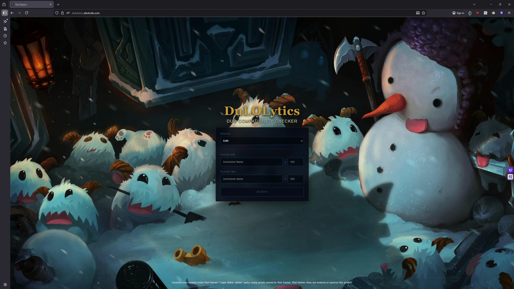

# DuLOLytics
A casual and fun tool to see how "compatible" you are with your duo, by getting an overview of your stats together, stats are fetched from Riot API!
Available at: [dulolytics.shotcrib.com](https://dulolytics.shotcrib.com)
--------------------------------------------------------
## Demo


## Overview
Enter two summoner names, tags and their corresponding region and get a score of how well the two players play together. Stats are fetched from the Riot Games API (cached in Redis to save on API calls), then added together into a compatibility score. Very crude and not very accurate, but a fun baseline!

## Tech Stack


## Data


## Setup
### Prerequisites
- Docker

### Installation
```bash
git clone https://github.com/ShotCrib77/dulolytics
cd dulolytics
cp .env.example .env
docker compose up -d --build
```
Don't forget to fill in the .env file! See .env.example for reference.

## Notes
The data modeling was quite tricky. Having to really think about what data was needed for the apps purpose and how I could utlize that to create the data I wanted to get. It became a lot easier when thinking about just that, "what do I need for **this specific app**"

Getting stats that actually reflect player/duo skill is very difficult. Esspecially since there are 5 roles and each role have a bunch of diffrent playstyles and champ types that offer diffrent things to the team. The current product is therefore not very accurate in telling players what they do good or bad, but rather serves as a rough baseline of what they do good and what they do bad (on avrage) when playing together.

## License
[MIT](./LICENSE)

DuLOLytics was created under Riot Games' "Legal Jibber Jabber" policy using assets owned by Riot Games. Riot Games does not endorse or sponsor this project.
